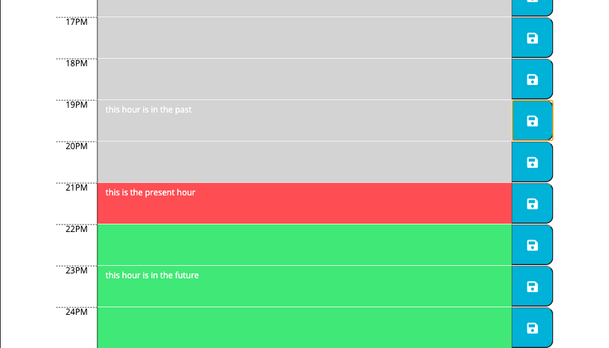

# calendarapp

A calendar app made with jquery, moment, local storage and bootsrap.
The page should display the date and the times. Any time block that is in the future will be highlighted green. Any time block that is in the past will be highlighted grey. The time block that is in the present time, will be highlighted red. When the page is refreshed, the date should persist becuase of local storage.

